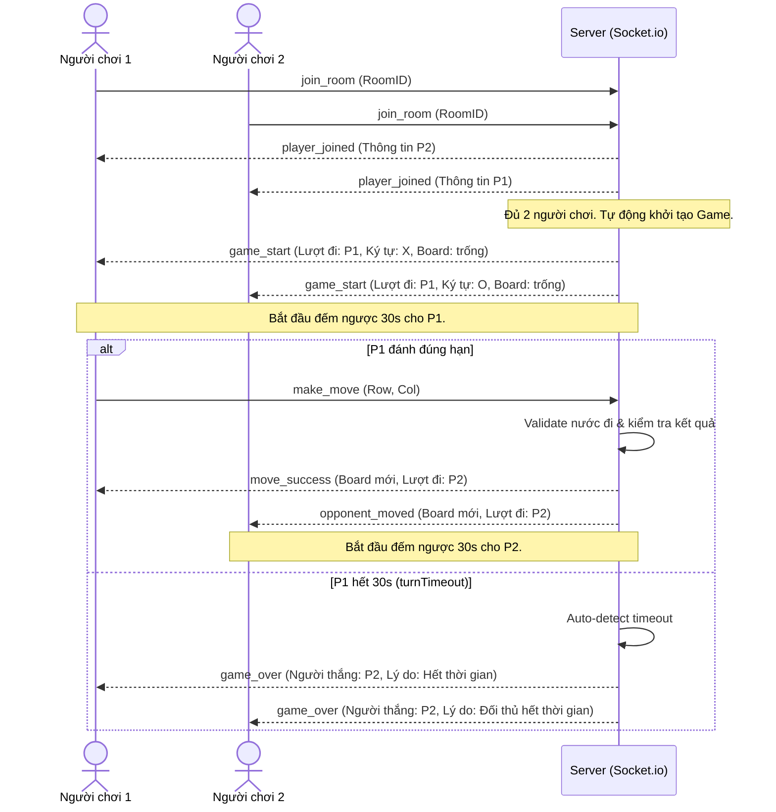

# Tài liệu Kiến trúc Hệ thống - Game TicTacToe Online

Tài liệu này định nghĩa kiến trúc hệ thống, quy chuẩn viết code và luồng dữ liệu cho dự án Game TicTacToe Online. Đây là tài liệu hướng dẫn (blueprint) dành cho Agent AI và các nhà phát triển tham gia xây dựng dự án.

---

## 1. Tổng quan Dự án (Project Overview)
Hệ thống là một ứng dụng web cho phép người chơi đăng ký tài khoản, tham gia phòng chơi (Room), chơi TicTacToe thời gian thực (real-time) với người chơi khác, đầu hàng, và tự động xử lý hết lượt chơi sau 30 giây.

### Các Tính năng Chính:
- **Xác thực người dùng**: Đăng ký, đăng nhập.
- **Quản lý phòng (Lobby & Room)**: Tạo phòng, tham gia phòng qua mã phòng, danh sách phòng chờ.
- **Gameplay TicTacToe**:
  - Bàn cờ có thể chọn kích thước 3x3, 6x6, 9x9, 11x11, 15x15. Thắng khi có 3,4,5 ô liên tiếp theo hàng, cột, đường chéo tùy kích thước bàn cờ.
  - Phân định lượt chơi (X đi trước, O đi sau).
  - Bộ đếm thời gian 30 giây (30s Turn Timer) cho mỗi lượt. Nếu hết 30s mà không đi, người chơi đó sẽ bị xử thua hoặc chuyển lượt (tùy cấu hình logic game).
  - Tính năng đầu hàng (Surrender) trong khi trận đấu đang diễn ra.
  - Tự động phát hiện thắng/thua/hòa.

---

## 2. Công nghệ Sử dụng (Tech Stack)

### Giao diện (Frontend):
- **Framework**: ReactJS với TypeScript.
- **Styling**: Tailwind CSS & Component Library [shadcn/ui](https://ui.shadcn.com/) (xây dựng dựa trên Radix UI và Tailwind).
- **Quản lý State**: Redux Toolkit (để quản lý auth, game state, UI state).
- **Kiểm thực dữ liệu (Validation)**: Zod (kết hợp với React Hook Form).

### Máy chủ (Backend):
- **Platform**: NodeJS (sử dụng ExpressJS hoặc NestJS) kết hợp TypeScript.
- **Realtime Communication**: Socket.io (WebSockets) để truyền thông điệp real-time giữa Client và Server.
- **Database**: MongoDB (sử dụng Mongoose) hoặc PostgreSQL (sử dụng Prisma) để lưu trữ thông tin User, Lịch sử đấu.
- **Validation**: Zod (dùng cho việc validate payload API và Socket).

---

## 3. Quy chuẩn Viết Code (Code Standards & Style Guide)

Để đảm bảo code đồng nhất, dễ bảo trì và tránh lỗi runtime, toàn bộ mã nguồn phải tuân theo các quy tắc sau:

### Quy tắc Chung:
- **TypeScript Strict**: Luôn bật chế độ `strict: true` trong cấu hình compiler. Không sử dụng kiểu dữ liệu `any`. Định nghĩa rõ ràng interface/type cho tất cả dữ liệu đầu vào/ra.
- **Đặt tên hàm & biến**: Sử dụng định dạng `camelCase` (ví dụ: `handleSendMessage`, `currentTurn`, `getUserProfile`).
- **Đặt tên Component/Class**: Sử dụng định dạng `PascalCase` (ví dụ: `GameBoard`, `UserProfileCard`).
- **Đặt tên Interface/Type**: Sử dụng định dạng `PascalCase` (ví dụ: `IUser`, `GameState`).
- **Đặt tên Hằng số**: Sử dụng định dạng `UPPER_SNAKE_CASE` (ví dụ: `MAX_TURN_TIME = 30`).

### ReactJS (Frontend):
- **Function Component**: Luôn sử dụng Function Component kết hợp với React Hooks. Không sử dụng Class Component.
- **Component File Structure**: Mỗi Component nên được đặt trong một thư mục riêng cùng với file style phụ trợ hoặc test nếu có (ví dụ: `/components/GameBoard/GameBoard.tsx`).
- **Zod & React Hook Form**: Tất cả các form nhập liệu (Đăng ký, Đăng nhập, Tạo phòng) phải được validate thông qua Zod schema trước khi submit lên server.

### Redux State Management:
- Sử dụng **Redux Toolkit** (`@reduxjs/toolkit`) để quản lý global state.
- Chia state thành các slice rõ ràng:
  - `authSlice.ts`: Quản lý thông tin đăng nhập, token, user profile.
  - `gameSlice.ts`: Quản lý trạng thái bàn cờ hiện tại, lượt đi, danh sách người chơi trong phòng, thời gian đếm ngược.
  - `socketSlice.ts`: Quản lý kết nối socket.

---

## 4. Luồng Nghiệp vụ & Thiết kế Realtime (Socket.io)

Việc truyền tải trạng thái bàn cờ, lượt chơi và bộ đếm thời gian được thực hiện thông qua Socket.io.

### Luồng Trận đấu:



### Các sự kiện Socket chính (Socket Events):

#### Gửi từ Client (Client-to-Server Events):
1. `create_room`: Yêu cầu tạo phòng mới với cấu hình bàn cờ.
   - Payload Zod:
     ```typescript
     const CreateRoomSchema = zod.object({
       userId: zod.string(),
       boardSize: zod.union([
         zod.literal(3),
         zod.literal(6),
         zod.literal(9),
         zod.literal(11),
         zod.literal(15)
       ]),
       winCondition: zod.union([
         zod.literal(3),
         zod.literal(4),
         zod.literal(5)
       ])
     });
     ```
2. `join_room`: Yêu cầu tham gia một phòng chơi.
   - Payload Zod:
     ```typescript
     const JoinRoomSchema = zod.object({
       roomId: zod.string().min(1),
       userId: zod.string()
     });
     ```
3. `make_move`: Thực hiện đánh vào một ô trên bàn cờ.
   - Payload Zod:
     ```typescript
     const MakeMoveSchema = zod.object({
       roomId: zod.string(),
       row: zod.number().min(0).max(14), // Tối đa index 14 cho bàn cờ 15x15
       col: zod.number().min(0).max(14)
     });
     ```
4. `surrender`: Xin đầu hàng.
   - Payload Zod:
     ```typescript
     const SurrenderSchema = zod.object({
       roomId: zod.string()
     });
     ```

#### Gửi từ Server (Server-to-Client Events):
1. `room_state`: Cập nhật toàn bộ trạng thái phòng bao gồm cấu hình bàn cờ (`boardSize`, `winCondition`).
2. `game_start`: Bắt đầu ván đấu (xác định ai đi trước, ký tự quân cờ, cấu hình bàn cờ).
3. `move_update`: Cập nhật bàn cờ sau mỗi nước đi hợp lệ và chuyển lượt đếm ngược.
4. `timer_tick`: Gửi thời gian còn lại (giây) cho hai client cập nhật UI.
5. `game_over`: Kết thúc trận đấu (chiến thắng do thắng cờ, đối thủ đầu hàng, hoặc đối thủ hết thời gian).

---

## 5. Cấu trúc Thư mục Đề xuất (Project Structure)

Dự án được xây dựng với sự kết hợp tối ưu:
* **Frontend**: Sử dụng mô hình **Feature-Based Architecture** (phổ biến và thực tế nhất trong hệ sinh thái React) để gom nhóm code theo tính năng, giúp dễ quản lý và mở rộng.
* **Backend**: Sử dụng mô hình **Clean Architecture** để tách biệt nghiệp vụ cốt lõi (Game Engine, Room, Auth use cases) khỏi Express và Socket.io.

### Frontend Structure (React + TypeScript + Redux - Feature-Based):
Các module được tổ chức trong thư mục `features/`, mỗi feature sẽ tự quản lý Components, Hooks, API, Redux Slice và Validation Schemas của riêng mình.
```text
src/
├── assets/             # Hình ảnh, icons, fonts dùng chung
├── components/         # UI components dùng chung cho toàn bộ dự án
│   └── ui/             # Components xuất bản từ shadcn/ui (Button, Dialog, Input...)
├── config/             # Cấu hình dự án (Constants, API endpoints...)
├── features/           # Nơi chứa các thư mục chức năng (Feature-based)
│   ├── auth/           # Module xác thực (Đăng ký, Đăng nhập)
│   │   ├── api/        # Cuộc gọi API liên quan tới auth (login, register)
│   │   ├── components/ # Form đăng ký, Form đăng nhập
│   │   ├── hooks/      # Hooks xác thực (useAuth)
│   │   ├── schemas/    # Zod validation schemas cho form đăng nhập/đăng ký
│   │   ├── slices/     # Redux Toolkit Slice quản lý auth state
│   │   └── types/      # Định nghĩa types riêng cho auth
│   ├── game/           # Module trò chơi (Bàn cờ, Phòng chờ, Trận đấu)
│   │   ├── api/        # Cuộc gọi API tạo phòng, danh sách phòng
│   │   ├── components/ # GameBoard, Lobby, BoardSizeSelector, TurnTimer
│   │   ├── hooks/      # Custom hooks xử lý game (useGameLogic, useTimer)
│   │   ├── schemas/    # Zod schemas tạo phòng, đánh cờ
│   │   ├── slices/     # Redux Toolkit Slice quản lý game state (board, players)
│   │   ├── types/      # Định nghĩa các types game, board, move
│   │   └── utils/      # Thuật toán kiểm tra thắng thua theo kích thước cờ (Caro/TicTacToe)
│   └── socket/         # Module kết nối Socket realtime
│       ├── hooks/      # Custom hook lắng nghe socket events (useSocket)
│       └── slices/     # Redux Slice quản lý trạng thái kết nối socket
├── layouts/            # Cấu trúc giao diện khung (MainLayout, AuthLayout)
├── pages/              # Các trang chính của ứng dụng (LoginPage, LobbyPage, GamePage)
├── providers/          # Gom nhóm các provider (Redux Provider, Theme Provider...)
├── store/              # Thiết lập Redux Toolkit Store chính (index.ts, hooks.ts)
├── styles/             # Chứa style css chính (index.css)
├── utils/              # Các helper functions dùng chung (format, localStorage...)
├── App.tsx             # Cấu hình Routing và cấu trúc view chính
└── main.tsx            # Điểm gắn kết của ứng dụng React (Entry point)
```

### Backend Structure (NodeJS + TS + Clean Architecture):
Backend phân tách rõ rệt 4 lớp chính của Clean Architecture để giữ phần xử lý game và database độc lập:
```text
src/
├── domain/                      # 1. Lớp Core Domain (Entities & Business Rules - Pure TS)
│   ├── entities/                # Định nghĩa User, Room, Board, Move
│   └── services/                # GameEngine: Kiểm tra nước đi hợp lệ, tìm dòng 3,4,5 liên tiếp để tính thắng
├── use-cases/                   # 2. Lớp Nghiệp vụ ứng dụng (Use Cases)
│   ├── auth/                    # RegisterUser, LoginUser
│   ├── game/                    # CreateRoom, JoinRoom, MakeMove, Surrender, HandleTimeout
│   └── repositories/            # Interfaces của các Repositories (ví dụ: IUserRepository)
├── adapters/                    # 3. Lớp Giao tiếp (Interface Adapters)
│   ├── controllers/             # HTTP Controllers (Express routing handler)
│   ├── presenters/              # Định dạng response/payload cho client (HTTP & Socket)
│   ├── repositories/            # Triển khai thực tế của Repository Interface (MongooseUserRepository)
│   └── socket/                  # Socket Event Controllers (Lắng nghe & định tuyến sự kiện realtime)
├── infrastructure/              # 4. Lớp Cơ sở hạ tầng (Frameworks & Drivers - Ngoài cùng)
│   ├── database/                # Khởi tạo kết nối MongoDB, Mongoose Schemas & Models
│   ├── webserver/               # Cấu hình Express App, Routing, JWT Middleware
│   └── socket-server/           # Khởi tạo và quản lý Socket.io Server instance
├── schemas/                     # Zod Validation Schemas cho API và Socket payloads
├── shared/                      # Các lớp tiện ích dùng chung (Logger, TokenManager, PasswordHasher)
├── app.ts                       # Khởi tạo & Phối hợp các thành phần của Express
└── server.ts                    # Entry point của server
```


---


## 6. Sơ đồ Thực thể Dữ liệu (Database Schema)

Dưới đây là thiết kế Schema cơ bản dùng để validate và lưu trữ thông tin:

### User Schema (MongoDB/PostgreSQL):
- `id`: string (Khóa chính)
- `username`: string (unique, validation: `z.string().min(3).max(20)`)
- `passwordHash`: string (mật khẩu đã băm bcrypt)
- `eloRating`: number (mặc định: 1200 - dùng để tính rank nếu cần mở rộng)
- `matchesPlayed`: number
- `matchesWon`: number

### Game History Schema:
- `id`: string
- `playerX`: string (UserId)
- `playerO`: string (UserId)
- `winner`: string (UserId hoặc 'draw' nếu hòa)
- `reason`: string ('normal', 'surrender', 'timeout')
- `moves`: array của `{ step: number, player: string, row: number, col: number, timeSpent: number }`
- `playedAt`: date

---

## 7. Logic Đếm thời gian (30s Turn Timer Logic)
Để đảm bảo tính chính xác và tránh gian lận phía client:
1. **Quản lý Timer trên Server**:
   - Mỗi phòng chơi đang active trên server sẽ có một đối tượng quản lý thời gian (ví dụ: sử dụng `setInterval` hoặc thư viện scheduler).
   - Khi chuyển lượt cho người chơi A, Server bắt đầu đếm ngược từ 30 về 0.
   - Mỗi giây, Server gửi event `timer_tick` kèm số giây còn lại (ví dụ `{ timeLeft: 28 }`) qua socket room để cả 2 Client hiển thị.
2. **Xử lý Timeout**:
   - Nếu A đánh trước 30s: Server xóa timer hiện tại, cập nhật trạng thái bàn cờ, chuyển lượt sang B, và tạo timer mới 30s cho B.
   - Nếu A hết 30s: Server hủy timer, tự động gửi event `game_over` thông báo B thắng do đối thủ quá giờ.

---

## 8. Kế hoạch Phát triển Từng Bước (Milestones)

1. **Giai đoạn 1: Thiết lập & Đăng ký/Đăng nhập**
   - Thiết lập cấu hình TypeScript và cấu trúc thư mục Frontend + Backend.
   - Tạo DB connection và Model User.
   - Viết API đăng ký/đăng nhập phía Backend (validate bằng Zod, tạo JWT token).
   - Thiết lập React Router, Redux Toolkit, shadcn/ui và thiết kế giao diện Đăng ký, Đăng nhập phía Frontend.

2. **Giai đoạn 2: Tích hợp Socket & Sảnh Chờ (Lobby)**
   - Khởi tạo Socket.io server trên Backend và Socket.io client trên Frontend.
   - Viết API/Socket Event tạo phòng và tìm kiếm phòng trống.
   - Thiết kế màn hình Lobby hiển thị danh sách phòng, trạng thái kết nối.

3. **Giai đoạn 3: Logic Gameplay & Giao diện Bàn cờ**
   - Thiết kế UI Bàn cờ linh hoạt kích thước (3x3, 6x6, 9x9, 11x11, 15x15) responsive với Tailwind và shadcn/ui.
   - Đồng bộ hóa trạng thái bàn cờ từ server xuống 2 client.
   - Xây dựng logic kiểm tra nước đi hợp lệ và kiểm tra thắng/thua/hòa (ngang, dọc, chéo) động theo kích thước và số ô liên tiếp yêu cầu (3, 4, 5) ở Backend.


4. **Giai đoạn 4: Bộ đếm thời gian & Đầu hàng**
   - Triển khai logic đếm ngược 30 giây ở Backend, đồng bộ thời gian real-time.
   - Thêm nút "Đầu hàng", gửi yêu cầu lên server kết thúc trận đấu ngay lập tức.
   - Kiểm thử các trường hợp gián đoạn (mất kết nối đột ngột, thoát trình duyệt).
